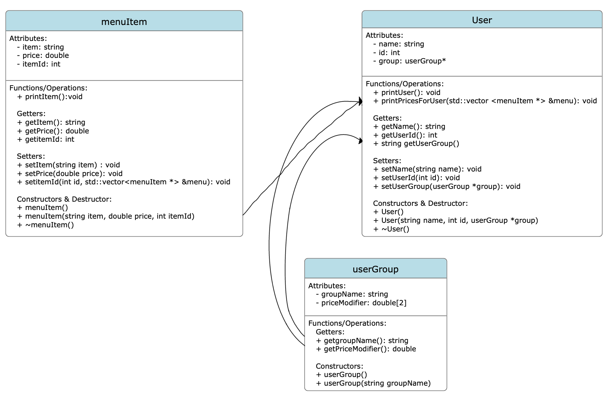

# pestucoursework
Programming languages (Програмни езици - ПЕ) course work from my third year at TU-Sofia, where it received a perfect grade of 6 (Excellent).

### Overview & Key Features
This project is a ***Cafeteria Managment System (TUCMS)*** built entirely in C++.
Some of its features include:
* **Role-based pricing** based on user groups: Students (50% off), Teachers (10% off) and external users/guests (no discount).
* **Data persistence** with custom saving and loading system that serializes objects into CSV-formatted text files (`menuDB.txt` and `usersDB.txt`) to preserve state between sessions.
* **Input Validation & Error Handling** by utilizing try-catch blocks and stream clearing to handle invalid inputs (e.g. entering text when a number is expected) without crashing.
* **Memory Safety** by ensuring that all dynamically allocated objects are properly deleted upon program exit to prevent memory leaks.

## Architecture & OOP Design
The system is built on strict OOP principles, utilizing Encapsulation to protect state integrity. The logic is divided into three core classes:
1. `menuItem`: Manages item IDs, names, and base prices.
2. `User`: Manages user details and holds a pointer to their associated group.
3. `userGroup`: Defines the discount modified (0.5 for students, 0.9 for teachers) and group name.



## How to Build and Run
To compile and run this project locally via terminal:
1. Clone the repository
```bash
git clone https://github.com/vpatrikov/pestucoursework
cd pestucoursework
```
2. Compile the source files:
```bash
g++ main.cpp file_manager.cpp menuItem.cpp User.cpp userGroup.cpp -o cafeteria_system
```
3. Run the executable
```bash
./cafeteria_system
```
